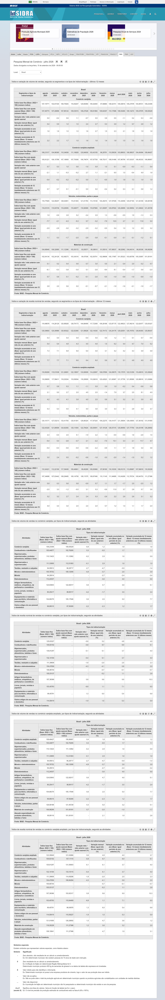
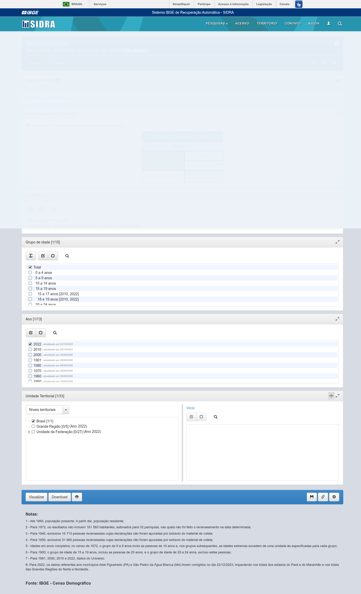
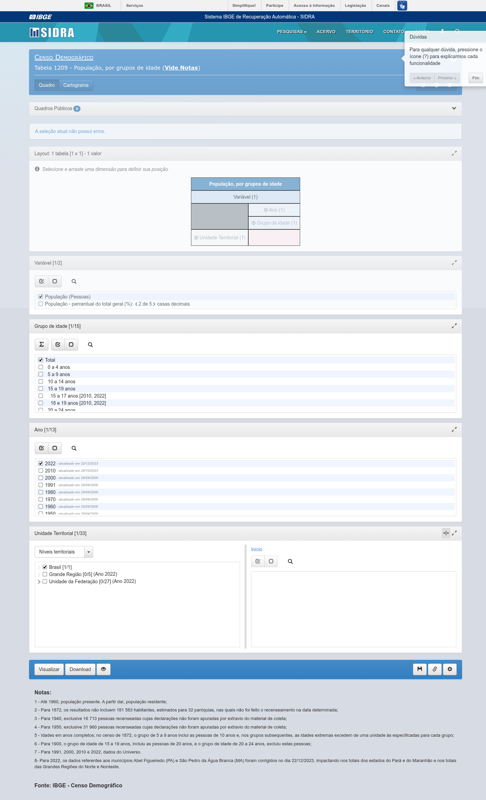
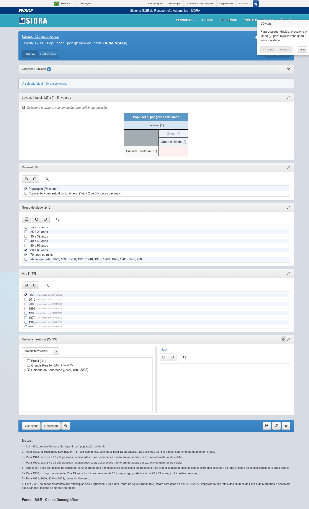
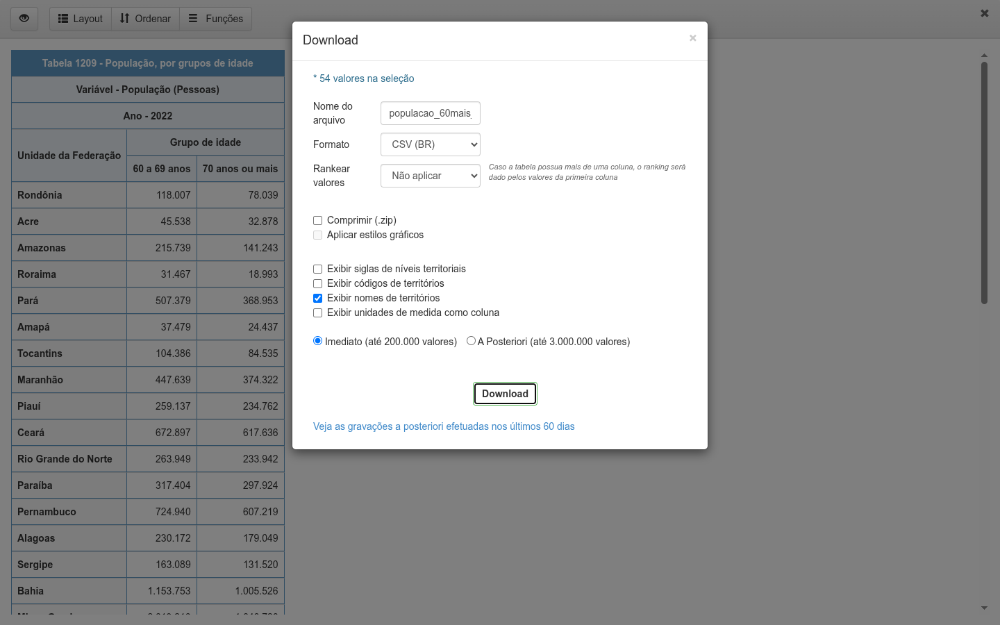

# Desafio IBGE 1209 — População de 60 anos ou mais

[](https://github.com/dev-christianmendes/desafio-ibge-1209-lev/actions)
[]()
[]()
[]()
[]()

Automação RPA que navega pelo site do **SIDRA/IBGE** (sem usar a API REST),
localiza a **Tabela 1209** (População, por grupos de idade), aplica o recorte
**"60 anos ou mais"** para as **27 Unidades da Federação** no ano de **2022** e
baixa o resultado em CSV. O mesmo fluxo é coberto por testes unitários e por
testes e2e contra o site real.

## Resumo

| Item | Valor |
| --- | --- |
| Tabela | 1209 — População, por grupos de idade |
| Recorte de idade | 60 a 69 anos + 70 anos ou mais (juntas = 60 anos ou mais) |
| Recorte territorial | 27 Unidades da Federação (sem "Brasil") |
| Ano | 2022 (Censo Demográfico) |
| Saída | `dados/populacao_60mais_1209.csv` |

O CSV é gerado navegando pela interface do SIDRA como um usuário faria: abrir a
home, buscar o código da tabela, configurar os filtros, visualizar e baixar.
Nenhum dado é fabricado e nenhuma URL de tabela está fixada no código.

## Entregáveis no repositório

O `dados/populacao_60mais_1209.csv` e as evidências em `evidencias/` estão
versionados aqui — dá para conferir o resultado final sem rodar nada. Ambos são
produzidos pela automação: ao executar `python desafio_ibge_1209.py`, o CSV é
reescrito com o mesmo conteúdo (a execução é determinística) e o fluxo volta a
gerar as evidências.

## Stack

- Python 3.10
- Playwright (Chromium, modo headed)
- pytest + pytest-cov (unitários com 100% de cobertura de linhas e branches)
- Ruff (lint)
- GitHub Actions (CI) e commitlint (Conventional Commits)
- SonarQube (etapa opcional no CI — ver [CI](#ci--cd))

Há também `package.json`/`package-lock.json` no repositório, mas isso não é
stack de runtime: o Node.js ali serve apenas ao `commitlint`, que valida o
formato das mensagens de commit no pipeline. O projeto em si é Python.

## Estrutura

```
.
├── desafio_ibge_1209.py        # entry point da automação (CLI)
├── src/
│   ├── config/settings.py      # constantes, seletores e caminhos
│   ├── pages/                  # page objects (home, tabela, base)
│   ├── services/               # orquestração do fluxo RPA
│   ├── utils/                  # logging e evidências (screenshots)
│   └── validation/             # validação do CSV baixado
├── tests/
│   ├── unit/                   # testes offline com um harness fake
│   └── e2e/                    # fluxo completo contra o SIDRA real
├── evidencias/                 # screenshots gerados a cada execução
├── dados/                      # CSV final
├── .github/workflows/          # CI (qualidade) e E2E (sob demanda)
└── sonar-project.properties    # configuração do SonarQube
```

## Instalação

```bash
python3.10 -m venv .venv
source .venv/bin/activate
pip install -r requirements-dev.txt
python -m playwright install --with-deps chromium
```

Os testes unitários não dependem de rede nem de browser (usam um harness local
em `tests/unit/fake_playwright.py`). Só os testes e2e precisam de display e de
acesso ao site.

## Execução

```bash
# fluxo completo (headed):
python desafio_ibge_1209.py

# opções disponíveis:
python desafio_ibge_1209.py \
  --output dados/populacao_60mais_1209.csv \
  --evidencias evidencias \
  --headless \
  --log-file logs/sidra.log
```

Ao final, o script imprime um resumo:

```
STATUS: APROVADO
Projeto: /home/.../desafio-ibge-1209
Tabela encontrada: Tabela 1209 - População, por grupos de idade
Ano utilizado: 2022
Configuração de idade: 60 a 69 anos + 70 anos ou mais (60 anos ou mais)
Configuração territorial: Unidades da Federação (27)
CSV: /home/.../dados/populacao_60mais_1209.csv
Quantidade de registros: 27
Total 60+ (Brasil): 32.113.490
```

Se qualquer etapa falhar, um screenshot `erro-{etapa}.png` é salvo e o processo
encerra com código 1.

## Testes

```bash
# unitários (offline) + cobertura mínima de 100%:
pytest -m "not e2e" --cov=src --cov=desafio_ibge_1209 \
  --cov-branch --cov-report=term-missing --cov-fail-under=100

# e2e contra o SIDRA real (recomendo usar xvfb):
xvfb-run -a pytest tests/e2e -v

# lint:
ruff check src desafio_ibge_1209.py tests
```

Estado atual: 77 testes unitários passando com cobertura total (linhas e
branches) e os 6 testes e2e validando o fluxo no site real.

## Como a automação funciona

1. **Abrir a home** (`open_home`): espera o desafio do Cloudflare liberar a
   página (título deixar de ser "Just a moment").
2. **Buscar a tabela** (`search_table`): clica na lupa, digita `1209`, confirma
   com Enter e aguarda a URL `/Tabela/1209`.
3. **Configurar idade** (`configure_idade`): tira o "Total" e marca as duas
   categorias que formam o recorte 60+.
4. **Selecionar ano** (`selecionar_ano`): escolhe o ano mais recente disponível
   (2022), considerando o ano preferido configurado.
5. **Recorte territorial** (`activate_uf`): ativa o nível Unidade da Federação e
   desmarca o "Brasil", garantindo as 27 UFs.
6. **Visualizar** (`visualizar`): clica em Visualizar e aguarda o resultado.
7. **Download** (`download_csv`): abre o modal com foco e Enter (o clique
   simples é bloqueado por um overlay do SIDRA), define nome/formato (`br.csv`),
   desmarca compactar e captura o download com `expect_download`.
8. **Validar** (`validate_csv`): confere o conteúdo baixado.

O pipeline inteiro usa esperas em condições reais de UI (títulos, textos
visíveis, URL e `expect_download`) — nada de `time.sleep` arbitrário.

## Validação do CSV

A validação roda ao final de cada automação e também nos testes. Ela confere:

- existência do arquivo, extensão `.csv` e conteúdo não vazio (UTF-8 com BOM,
  delimitador `;`);
- título contendo "Tabela 1209" e "População" e variável presente no cabeçalho;
- ano 2022 no cabeçalho;
- colunas `60 a 69 anos` e `70 anos ou mais`;
- exatamente 27 Unidades da Federação, sem territórios inesperados;
- valores inteiros positivos; totais por UF e total geral de 60+.

## Evidências do fluxo

Screenshots gerados durante a execução real da automação (reproduzíveis no
diretório `evidencias/`):

**01 — Página inicial do SIDRA**



**02/03 — Busca e Tabela 1209**





**04 — Filtros configurados (idade 60+ e UFs)**



**05/06 — Download e resultado validado**




Ao final da execução, o relatório sai no terminal:

```
STATUS: APROVADO
Tabela encontrada: Tabela 1209 - População, por grupos de idade
Ano utilizado: 2022
Configuração de idade: 60 a 69 anos + 70 anos ou mais (60 anos ou mais)
Configuração territorial: Unidades da Federação (27)
Quantidade de registros: 27
Total 60+ (Brasil): 32.113.490
```

## Principais desafios encontrados

- **Cloudflare no SIDRA**: em modo headless o desafio do Cloudflare não resolve
  de forma confiável, então o navegador roda headed. Para não ficar em `sleep`
  cego, espero o título da página sair de "Just a moment", com uma tentativa de
  reload caso o desafio demore.
- **Overlay bloqueando o clique no botão de downloads**: o clique normal em
  `#botao-downloads` é interceptado por um overlay do SIDRA. Resolvi dando
  `focus()` no botão e confirmando com `Enter` via teclado, o que dispara o
  diálogo com o evento real.
- **Disparo do download**: dentro do modal, seleciono nome/formato `br.csv`,
  desmarcando a compactação, e capturo o arquivo com `expect_download` em vez de
  depender de caminhos ou URLs inferidas.
- **Árvore territorial sem checkbox aninhado**: no painel de territórios, o item
  da lista já possui a classe `.sidra-check` (não há um `.sidra-check` filho como
  nas demais listas). A leitura do estado precisa tratar os dois casos — retomei
  isso e cobri com teste.
- **Anos com rótulos longos**: a lista de anos traz textos como "2022 - atualizado
  em 22/12/2023"; faço o parse da primeira palavra como o ano e ignoro linhas
  não numéricas.
- **CSV com BOM e aspas**: o arquivo real usa UTF-8 com BOM, `;` como delimitador
  e aspas em todo campo. A validação lê com `utf-8-sig` e separador `;`, além de
  conferir título, variável, ano, colunas de idade, UFs e valores positivos.
- **Recorte garantido sem API**: como não posso usar a API REST, garanto o
  recorte 60+ na interface (marcando as duas faixas e as 27 UFs) e confirmo a
  soma na validação, sempre conferindo que o resultado tem exatamente 27 UFs.

## CI / CD

- **`ci.yml`** — roda em todo push/PR para `main`:
  - `ruff` (lint);
  - testes unitários com cobertura mínima de 100%;
  - `commitlint` validando as mensagens dos commits;
  - análise do **SonarQube**, quando o token estiver disponível (ver abaixo).
- **`e2e.yml`** — sob demanda (`workflow_dispatch`): instala o Chromium com
  dependências, roda os testes e2e via `xvfb-run` e sobe as evidências como
  artefato.

### Sobre o SonarQube

Não tenho `SONAR_TOKEN` configurado neste repositório. A etapa do SonarQube no
`ci.yml` pula enquanto o secret não existir (condicional por passo), então ela
nunca bloqueia o pipeline — deixei montada apenas para
documentar o padrão de análise que sigo (cobertura 100%, duplicação < 3% e
vulnerabilidades em zero). Para ativá-la, basta adicionar `SONAR_TOKEN` (e
`SONAR_HOST_URL`, se não for o SonarCloud público) nos secrets do repositório.
O `sonar-project.properties` está pronto para isso.

## Decisões e limitações

- **Navegador headed**: o SIDRA depende do Cloudflare e o desafio não resolve
  de forma confiável em headless; por isso o padrão é `HEADLESS = False`.
- **Unitários offline**: uso um harness local que imita a fatia do Playwright
  usada pelo código, mantendo os testes rápidos e determinísticos.
- **Seletores centralizados** em `src/config/settings.py` e nos page objects,
  para facilitar ajustes se o SIDRA mudar a interface.
- **CSV cru preservado**: não injeto colunas calculadas no arquivo; o recorte
  60+ é garantido na validação (soma das duas faixas).
- **Segurança**: o fluxo abre um contexto isolado de navegador, só interage com
  o site do IBGE, grava arquivos em diretórios locais e não lida com
  credenciais. Nenhum secret aparece no repositório.

## Licença

Distribuído sob a [licença MIT](LICENSE).